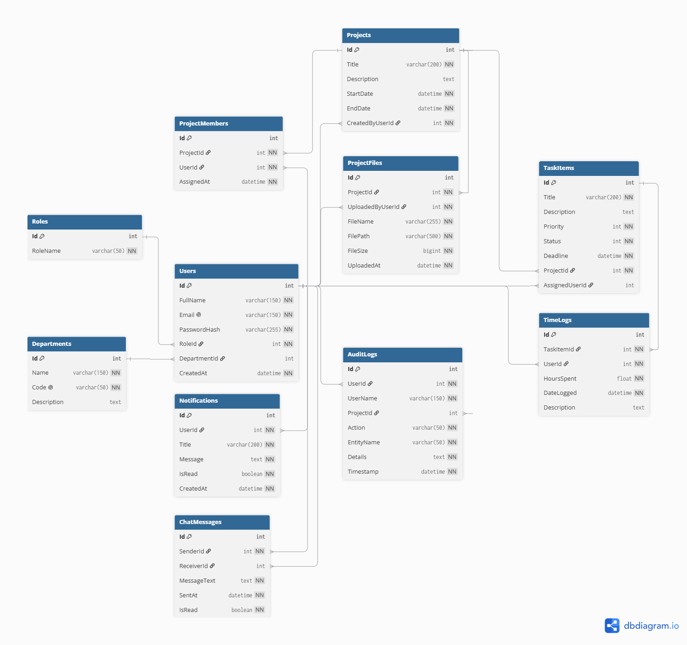

# 🚀 TaskFlow SaaS - Enterprise Task & Project Management System

[](https://dotnet.microsoft.com/)
[](https://dotnet.microsoft.com/apps/aspnet)
[](https://learn.microsoft.com/ef/)
[](https://www.microsoft.com/sql-server)
[](https://getbootstrap.com/)
[](https://github.com/)

> **TaskFlow SaaS** là hệ thống quản lý công việc và dự án doanh nghiệp đa tầng hoàn chỉnh, được xây dựng trên nền tảng **ASP.NET Core 10 MVC**, **Entity Framework Core** và **SQL Server**. Hệ thống cung cấp giải pháp toàn diện cho việc phân quyền (RBAC), quản lý vòng đời dự án, bảng Kanban tương tác, quản lý tiến độ công việc, chấm công thời gian, báo cáo kỷ luật nhân sự và giám sát nhật ký kiểm toán (Audit Logs).

---

## 🌟 Tính Năng Nổi Bật (Key Features)

### 1. 🛡️ Phân Quyền & Bảo Mật (Role-Based Access Control - RBAC)
- **3 Cấp Phân Quyền Độc Lập**:
  - **Admin**: Quản trị toàn bộ hệ thống, quản lý tài khoản người dùng, phòng ban, thông báo toàn công ty, xem xét phê duyệt các đề xuất kỷ luật/khai trừ nhân sự và xem toàn bộ nhật ký hệ thống (Audit Logs).
  - **Manager**: Khởi tạo và quản lý dự án, phân công nhân sự, quản lý nhiệm vụ (Tasks), theo dõi bảng Kanban, quản lý tài liệu đính kèm và gửi báo cáo nhân sự vi phạm lên Admin.
  - **Employee**: Xem danh sách công việc được giao, cập nhật tiến độ, ghi nhận nhật ký làm việc (TimeLog), trao đổi tin nhắn và nhận thông báo theo thời gian thực.
- **Bảo mật**: Mã hóa mật khẩu chuẩn `BCrypt`, xác thực phiên với `Cookie Authentication`, bảo vệ chống `CSRF` (ValidateAntiForgeryToken), ngăn ngừa `SQL Injection` và `XSS`.
- **Soft Delete & Bảo toàn Dữ liệu**: Cơ chế khóa/ngừng hoạt động tài khoản và lưu trữ dự án (Archive) mà không làm mất lịch sử hoặc gây đứt gãy quan hệ dữ liệu.

### 2. 📊 Bảng Điều Khiển Trực Quan (Executive Dashboards)
- Tổng hợp chỉ số KPI theo thời gian thực: Tổng dự án, tổng công việc hoàn thành, tỷ lệ hoàn thành, cảnh báo trễ hạn (Overdue Tasks).
- Biểu đồ phân bổ dự án theo trạng thái, biểu đồ nhân sự theo phòng ban với **Chart.js**.
- Khu vực hiển thị thông báo khẩn, thông báo ghim từ Admin.

### 3. 🗂️ Quản Lý Dự Án & Bảng Kanban (Project & Agile Kanban)
- Quản lý vòng đời dự án: Lập kế hoạch, Đang thực hiện, Hoàn thành, Tạm ngưng, Lưu trữ (Archive).
- **Kanban Board**: Kéo thả phân loại dự án và công việc theo mức độ ưu tiên (Low, Medium, High, Urgent) với AJAX phản hồi tức thì.
- Phân công Trưởng dự án (Project Manager) và các thành viên với vai trò cụ thể.
- Quản lý kho tài liệu đính kèm (Project Files) phân loại theo phiên bản và người tải lên.

### 4. 📋 Quản Lý Công Việc & Tiến Độ (Task Management)
- Tạo công việc chi tiết với: Tiêu đề, Mô tả, Hạn chót (Deadline), Mức độ ưu tiên, Người phụ trách.
- Cập nhật trạng thái trực quan: *To Do*, *In Progress*, *Review*, *Done*.
- Tự động cảnh báo công việc quá hạn hoặc cần ưu tiên cao.

### 5. ⏱️ Chấm Công & Nhật Ký Thời Gian (Time Tracking & Timesheet)
- Nhân viên ghi nhận số giờ làm việc (Hours Spent) theo từng đầu việc cụ thể kèm mô tả công việc.
- Quản lý (Manager) và Admin dễ dàng thống kê năng suất làm việc của từng thành viên trong dự án.

### 6. 🚨 Quy Trình Báo Cáo Vi Phạm Nhân Sự (Member Incident Reporting)
- Manager có thể gửi báo cáo kỷ luật hoặc **Đề nghị khai trừ thành viên khỏi dự án** kèm lý do chi tiết.
- Admin nhận thông báo tự động, xem xét hồ sơ vi phạm và ra quyết định **Phê duyệt khai trừ** hoặc **Khiển trách**.

### 7. 🔔 Hệ Thống Thông Báo & Cài Đặt Thông Báo
- Gửi thông báo tự động khi được giao việc, thay đổi tiến độ, có tin nhắn mới hoặc có quyết định kỷ luật.
- Người dùng có thể tùy chỉnh nhận thông báo theo sở thích cá nhân.

### 8. 📜 Nhật Ký Hệ Thống Toàn Diện (Enterprise Audit Logs)
- Lưu vết toàn bộ hoạt động quan trọng: Đăng nhập, Tạo/Sửa/Xóa Dự án, Phân công Task, Khóa tài khoản, Thay đổi quyền hạn,...

---

## 🏗️ Kiến Trúc Hệ Thống & Cơ Sở Dữ Liệu

### Sơ Đồ Cơ Sở Dữ Liệu (ERD Diagram)
Hệ thống được thiết kế chuẩn hóa quan hệ thực thể, tối ưu chỉ mục (Indexes) và ràng buộc toàn vẹn dữ liệu:



> Tài liệu phân tích Use Cases chi tiết: [Xem tài liệu USE CASES.pdf](docs/USE%20CASES.pdf)

---

## 💻 Công Nghệ Sử Dụng (Tech Stack)

| Hạng Mục | Công Nghệ / Thư Viện |
| :--- | :--- |
| **Backend Framework** | .NET 10.0 / C# 13, ASP.NET Core MVC |
| **ORM & Database** | Entity Framework Core 10.0, Microsoft SQL Server |
| **Bảo mật & Auth** | Cookie Authentication, BCrypt.Net, Anti-Forgery Tokens |
| **Frontend UI/UX** | Razor Views, Bootstrap 5.3, Glassmorphism Custom Theme, Bootstrap Icons |
| **Visuals & Charts** | Chart.js, FullCalendar |
| **Kiến Trúc** | MVC Pattern, Clean Service Layer, Dependency Injection, Repository/Service Pattern |

---

## 📁 Cấu Trúc Thư Mục Dự Án (Project Structure)

```text
TaskManagement_FullRelease_TeamPackage/
├── docs/                                # Tài liệu thiết kế & Sơ đồ hệ thống
│   ├── ERD.png                          # Sơ đồ quan hệ thực thể Database
│   └── USE CASES.pdf                    # Tài liệu đặc tả Use Cases
├── src/
│   └── TaskManagementWeb/               # Mã nguồn chính của ứng dụng
│       ├── Areas/                       # Kiến trúc phân vùng MVC
│       │   ├── Admin/                   # Quản trị hệ thống, User, Department, AuditLogs
│       │   ├── Manager/                 # Quản lý Dự án, Task, Kanban, Báo cáo vi phạm
│       │   └── Employee/                # Giao việc, Tiến độ, Chấm công TimeLog
│       ├── Controllers/                 # Public Controllers (Account, Notification, Home)
│       ├── Data/                        # ApplicationDbContext & SeedData
│       ├── Migrations/                  # Lịch sử EF Core Database Migrations
│       ├── Models/                      # Entities, Enums, ViewModels
│       ├── Services/                    # Business Logic Layer (Admin, Manager, Common)
│       ├── Views/                       # Razor Views & Shared Layouts
│       ├── wwwroot/                     # Static files (CSS, JS, Images, Videos, Uploads)
│       ├── appsettings.json             # Cấu hình chuỗi kết nối Database
│       └── Program.cs                   # Điểm khởi chạy & Đăng ký Service DI
├── TaskManagement.slnx                  # Solution file mở bằng Visual Studio
├── .gitignore                           # Danh sách loại trừ file rác / build artifacts
└── README.md                            # Tài liệu hướng dẫn dự án
```

---

## ⚡ Hướng Dẫn Cài Đặt & Chạy Nhanh (Quick Start)

### 1. Yêu cầu môi trường
- [.NET 10.0 SDK](https://dotnet.microsoft.com/download/dotnet/10.0) trở lên.
- [Microsoft SQL Server](https://www.microsoft.com/sql-server) (hoặc SQL Server Express / LocalDB).
- [Visual Studio 2022+](https://visualstudio.microsoft.com/) hoặc [Visual Studio Code](https://code.visualstudio.com/).

### 2. Cấu hình Chuỗi Kết Nối Database
Mở file `src/TaskManagementWeb/appsettings.json` và kiểm tra chuỗi kết nối:
```json
{
  "ConnectionStrings": {
    "DefaultConnection": "Server=.;Database=ACMF;Trusted_Connection=True;TrustServerCertificate=True"
  }
}
```
*(Nếu sử dụng SQL Express, đổi `Server=.` thành `Server=localhost\\SQLEXPRESS`)*.

### 3. Chạy Ứng Dụng
Mở Terminal tại thư mục gốc và chạy:
```bash
dotnet run --project src/TaskManagementWeb
```

> **Lưu ý**: Hệ thống đã được cấu hình tự động áp dụng Migration và nạp sẵn dữ liệu mẫu (`SeedData`) ngay trong lần chạy đầu tiên. Bạn không cần phải tạo bảng thủ công.

Sau khi khởi chạy thành công, truy cập trình duyệt tại: **`http://localhost:5009`** hoặc **`https://localhost:7009`**.

---

## 🔑 Tài Khoản Demo Khởi Tạo Sẵn (Default Accounts)

Hệ thống cung cấp sẵn các tài khoản demo cho từng phân quyền:

| Phân Quyền | Email Đăng Nhập | Mật Khẩu | Mô Tả Vai Trò |
| :--- | :--- | :--- | :--- |
| 👑 **Admin** | `admin@taskflow.com` | `Admin@123` | Quản trị toàn hệ thống, duyệt kỷ luật, xem nhật ký kiểm toán |
| 💼 **Manager** | `manager@taskflow.com` | `Manager@123` | Quản lý dự án, phân công task, kéo thả Kanban |
| 👷 **Employee 1** | `employee@taskflow.com` | `Employee@123` | Nhân viên thực thi task, cập nhật tiến độ, ghi TimeLog |
| 👩‍💻 **Employee 2** | `jane@taskflow.com` | `Employee@123` | Nhân viên thiết kế / thực hiện công việc dự án |

*(Tại màn hình Đăng nhập, có sẵn nút bấm 1-Click Fast Fill để điền nhanh tài khoản demo)*.

---

## 👨‍💻 Tác Giả (Author)

- **Developer**: Pham Tan Tai
- **GitHub**: [Pham Tan Tai](https://github.com/)
- **Dự án**: TaskFlow SaaS - Enterprise Task & Project Management System

---
*© 2026 Pham Tan Tai. All rights reserved.*
